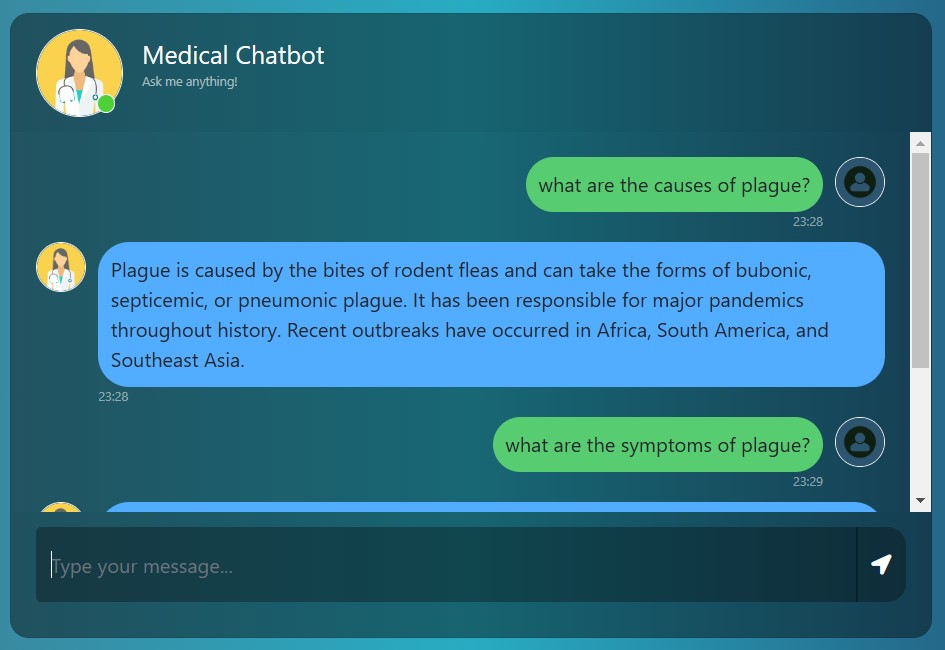
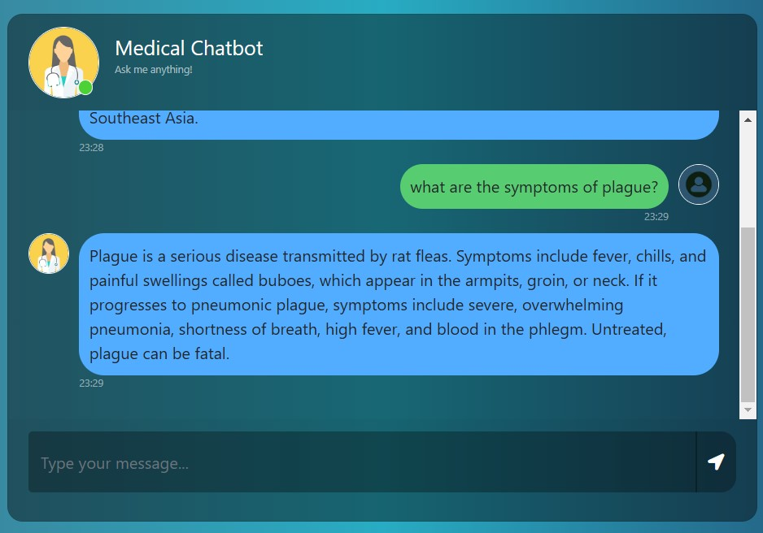

# **Medical Chatbot Using RAG**

## **Introduction**
This project is a medical chatbot designed to assist users by answering medical-related queries using a robust retrieval-augmented generation (RAG) framework. The chatbot leverages the **Pinecone vector database** for efficient document retrieval, **Mistralai LLM** from Hugging Face for natural language generation, and **Gale Encyclopedia for Medicine** as the primary knowledge base. It provides accurate, contextual, and relevant answers to medical queries in real time.

---

## **Features**
- **Interactive Chat Interface**: User-friendly chat interface built with HTML, Bootstrap, and jQuery.
- **Retrieval-Augmented Generation (RAG)**: Combines the power of document retrieval with generative AI for accurate responses.
- **Pinecone Vector Database**: Ensures fast and efficient similarity searches within the knowledge base.
- **Mistralai LLM**: A cutting-edge language model from Hugging Face.
- **Knowledge Base**: Uses the **Gale Encyclopedia for Medicine** to provide authoritative information.

---

## **Technology Stack**
- **Backend**:
  - Python (Flask Framework)
  - Pinecone Vector Database
  - Hugging Face's Mistralai LLM
- **Frontend**:
  - HTML5, CSS3 (Bootstrap Framework)
  - JavaScript (jQuery and AJAX)
- **Environment Configuration**:
  - `.env` file for API keys and sensitive configurations

---

## **Setup and Installation**

### Prerequisites
Ensure you have the following installed:
- Python 3.10 or later
- pip (Python package manager)
- Pinecone API key
- Hugging Face API key

### Steps
1. **Clone the Repository**
   ```bash
   git clone <repository-url>
   cd <repository-directory>

2. **Create Virtual Environment**
    ```bash 
    python -m venv env
    source env/bin/activate

3. **Install Dependencies**
    ```bash
    pip install -r requirements.txt

4. **Set Environment Variables**

   Create a `.env `file in the root directory and add:
    ```bash
    PINECONE_API_KEY=<your-pinecone-api-key>
    HUGGINGFACEHUB_API_TOKEN=<your-huggingface-api-token>

5. **Run the Files from "src" folder**
    - Navigate to the `src` folder:
        ```bash
        cd src
    
    - Execute the helper script to download and process embeddings:
        ```bash
        python helper.py
        ```
        It will load the pdf, split the text, and download HuggingFace Embedding model
    
    - Execute the helper script to download and process embeddings:
        ```bash
        python store_index.py
        ```
        It will store the embeddings as vectore database on Pinecone server 
    
6. **Run the Flask Application**
    ```bash
    python app.py

7. **Interface**






8. **Conversation History**:  
  A feature to maintain conversation history when explicitly passed as input will be implemented. This will allow:
    - Seamless continuation of user-bot interactions.
    - Retrieval of past interactions for context-aware responses.
    - Enhanced user experience, particularly for long or multi-turn conversations.

## License

This project is licensed under the [MIT License](LICENSE).  
You are free to use, modify, and distribute this software under the terms of the MIT License.

For more details, refer to the [LICENSE](LICENSE) file.
